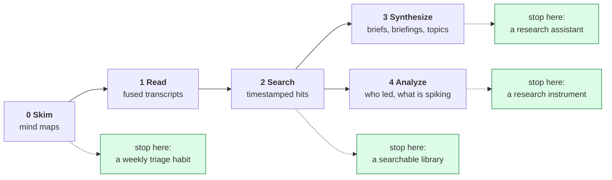
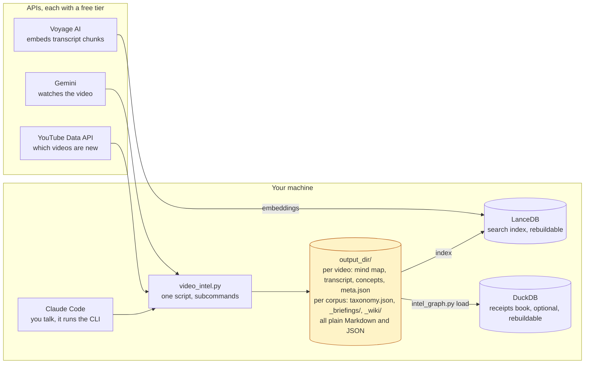
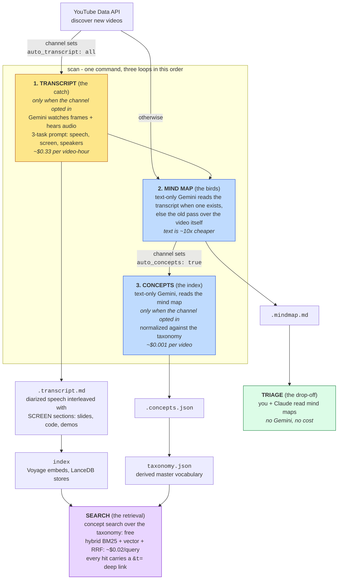

# Video Intel

> **30 seconds to read a mind map vs. 30 minutes to watch the video.**
> A channel's new uploads scanned in minutes, ~$0.15-0.25 per 15-minute video, and the Gemini free tier covers 8 hours of video a day.

Point it at the YouTube channels you follow. It watches the videos for you - frames, on-screen text and audio together - and writes back a mind map, a transcript that records what was *shown* as well as what was said, and, if you want it, a search index that answers a question with timestamped links to the moments that match. You read the mind maps, decide what deserves 30 minutes, and ask questions across everything you have indexed.

It is a Claude Code plugin: you say "scan my channels" or "what did anyone say about prompt caching", and Claude runs the tool. In daily use since March 2026 on a corpus of 2,400+ videos across 75 channels.

## What a Fused Transcript Looks Like

Traditional transcripts lose everything visual. When a presenter says "as you
can see here," you see nothing. The fused transcript captures both channels:

```text
[01:09] Ray (Developer and Instructor): "But then this introduced
a brand new problem whereby in session one you would have a pretty
fresh, clean, and relevant memory. And then as you go on, you would
notice that Claude Code decides to add more and more stuff to its
memory and you get noise and contradictions and stuff like that."

  SCREEN [01:09-01:31] [diagram]: Excalidraw diagram titled
  'THE PROBLEM WITH AI MEMORY', illustrating how memory accumulates
  noise and contradictions over multiple sessions (Session 1 to
  Session 20).

[01:32] Ray (Developer and Instructor): "And Claude did have some
instructions in the system prompt telling it to verify that the
memory is still correct and up-to-date, but that didn't really
do a good job."
```

This is real output from scanning [Ray Amjad's](https://youtube.com/@ramjad)
channel. Speaker names are identified from visual cues (Zoom labels, name
cards, badges, slide footers) with evidence provided for each identification.

## Pick your depth

Not everyone wants everything. Start with mind maps. Add transcripts, then search, when you want deeper evidence. Synthesis and analysis are two separate branches off the searchable corpus; neither needs the other. Every level is a fine place to stop.

| Level | You want to... | What runs | What it costs |
| --- | --- | --- | --- |
| **0 - Skim** | know which new videos deserve your time | `scan`, mind maps only | ~$0.15-0.25 per 15-minute video; the free tier covers a weekly scan |
| **1 - Read** | a transcript that includes what was on screen, with speakers named | `scan` with `auto_transcript: all` | ~$0.33 per video-hour |
| **2 - Search** | "what did anyone say about X", with a link to the exact second | `index` once (needs a free Voyage AI key), then `search --vector` | the one-time index is a few cents per channel; then ~$0.02 per query |
| **3 - Synthesize** | a brief that compares creators, a personalized catch-up guide, topic threads | `nugget`, `briefings --unseen`, `topics-build` | one text-only Gemini call per brief; briefings and topics are free |
| **4 - Analyze** | who reached an idea first, what is spiking, which creators cluster | the intelligence layer (DuckDB) | free, no API calls |
| **Side path** | Bosnian/Croatian/Serbian subtitles for one video | `translate_video.py` | cents per video |



Each level is one section further down this page. Level 4 has its own guide, [docs/intelligence-layer.md](docs/intelligence-layer.md), written for developers without a statistics background.

## Quick Start

```bash
# 1. API keys (both free)
export GEMINI_API_KEY=your_key    # https://aistudio.google.com/apikey
export YOUTUBE_API_KEY=your_key   # https://console.cloud.google.com/apis/credentials

# 2. Dependencies
pip install google-genai google-api-python-client pyyaml youtube-transcript-api

# 3. Clone the repo, cd into it, and open Claude Code:
git clone https://github.com/dzivkovi/video-intel.git
cd video-intel
claude
#    On first launch, Claude Code shows a trust prompt for the video-intel
#    plugin. Click "Install for this project". All three skills become available.
#    No manual config needed — the project settings auto-register the plugin.
#
# 4. Create your config from the template, add your channels, then scan:
cp config.yaml.example config.yaml      # Windows: copy config.yaml.example config.yaml
python scripts/video_intel.py scan
```

Or in Claude Code, just say:

- **"scan my channels"** → video-intel skill
- **"find videos about MCP"** → video-intel-search skill
- **"translate this YouTube video to Bosnian"** → translate-bcs skill

For detailed installation guidance across platforms, see
[INSTALLATION.md](INSTALLATION.md). The plugin format is Claude Code-specific; on
other tools that consume the open Agent Skills format, the individual skill
folders (`skills/video-intel/` or `skills/translate-bcs/`) may be usable
independently — interoperability with non-Claude-Code tools has not been verified
by this repo.

**Upgrading from v1.4.x or earlier:** The repo went from "single skill" to "plugin
with three skills." If you previously installed by copying the repo into
`~/.claude/skills/video-intel/`, remove that directory and re-install via one of
the plugin paths above. Claude Code manages the actual on-disk plugin cache
itself (under `~/.claude/plugins/cache/...`); users do not copy files there
directly.

## How It Works

Three services, one script, plain files on your disk. Nothing runs in the background and every derived store can be deleted and rebuilt.



Inside `scan`, the work is a narrowing funnel - like fishing, where you look for
birds before you cast a line and read the water before you commit to a spot.



**Transcript first, mind map second - the cost argument.** For any channel with `auto_transcript: all` (what the example config ships), `scan` transcribes first and then builds the mind map *from the transcript text*, not from the video. A text-only call against a 50 KB transcript costs roughly a tenth of a second pass over an hour of frames, and it has no frame cap. Only a channel with no transcript on disk falls back to the old mindmap-from-video path.

Three consequences worth knowing before you configure a channel: the expensive step runs first, so a transcript bug surfaces before you have paid for anything downstream; the mind map inherits the transcript's quality, and a transcript flagged severe is treated as unavailable so the mind map falls back to video rather than propagating the damage; and `concepts` reads the mind map, never the video, so it is always the cheap step.

**triage** - After scanning, ask Claude (no Gemini cost):

> "Read the mind maps in ~/video-intel/natebjones/ from this week and tell me
> which videos are worth watching for agentic AI patterns."

## Design principles

- **Gemini watches, Claude thinks.** Gemini sees frames at 1 FPS, reads on-screen text and hears audio in one pass. Claude never calls Gemini during triage: it reads the files Gemini produced. Best tool for each job, not competing models.
- **Multimodal, not transcript-based.** When a presenter says "as you can see here," the output records what was actually shown.
- **Three decoupled tasks, not one prompt.** Transcription, screen content and speaker identification run as separate tasks inside one prompt, so they do not compete for the model's attention (borrowed from Laurent Picard's research).
- **Read the mind map before the transcript.** A 30-second read before a 30-minute commitment. When transcripts are on, the pipeline runs the other way - it transcribes first and derives the mind map from the text, because that is cheaper - but your reading order is still mind map first.
- **One model replaces the four-tool transcription stack.** For getting words, speakers and slides out of a video, Gemini Flash does what Whisper + pyannote + Claude + Gemini did separately, and captures the visual channel they never could. (Discovery, embeddings and triage still use their own tools.)
- **Idempotent.** Re-running a scan skips what is done. Safe to interrupt, safe to re-run.
- **Prompts are files.** Every prompt lives in `prompts/`, self-contained and swappable. No hidden prefix assembly. The shipped templates are plain defaults: list your own folders in `prompt_dirs:` (or `$VIDEO_INTEL_PROMPT_DIR`) and a private file of the same name wins over the bundled one, so an opinionated version can live outside this repo while a fork keeps working on the defaults.
- **Per-channel config.** A daily creator gets `since: 10d`, a monthly one `since: 120d`. Each entry captures your relationship with that creator.
- **The tool only does the Gemini work.** Triage and deep-dives are conversations with Claude over the files, not API calls. They were in the design, then deliberately cut.

## Plugin Contents: Three Skills

This repo ships as a **plugin** containing three independent skills. They install
together; Claude picks the right one based on what you ask.

| Skill | What it does | Trigger phrases |
| ----- | ------------ | --------------- |
| **video-intel** | **Curate.** Scan YouTube channels, produce rich transcripts with on-screen content, generate mind maps, extract concepts, build the search index, and run corpus maintenance. Every command that writes to the corpus lives here. | "scan my channels", "transcribe this video", "rebuild the index", "clean up duplicates" |
| **video-intel-search** | **Query.** Search the corpus, retrieve evidence with timestamped deep links, synthesize a cross-creator brief, report corpus status. Read-only apart from the brief `nugget` saves. Safe to install globally and use from any project - see [INSTALLATION.md](INSTALLATION.md#claude-code-user-level-access-the-search-skill-from-any-project). | "what videos cover X", "what did [creator] say about Y", "nugget brief on X", "show me everything tagged [topic]" |
| **translate-bcs** | Translate YouTube videos and rich transcripts into Bosnian/Croatian/Serbian (BCS) subtitles. Two paths: fast captions-first via YouTube SRT for short videos, or rich-transcript-first via video-intel for long videos where the SRT path drifts. Also downloads English SRT only on request. | "translate to Bosnian/Croatian/Serbian", "BCS subtitles", "titl na bosanski", "just give me the SRT" |

The split between the first two is by **write scope**, not by topic: `video-intel-search` never mutates the corpus, which is what makes it safe to install once and query from anywhere. `translate-bcs` stays operationally independent of both - it does not read video-intel's channel config, taxonomy, or meta files. The integration point is a file handoff: for context-heavy videos, `translate-bcs` reads a rich transcript that `video-intel` produced, and Claude orchestrates both CLI steps in one conversation.

## Reusable beyond video-intel

This repo is also a worked reference for a few patterns that carry to any corpus-intelligence project, stated with honest maturity so you know what is proven vs still a hypothesis:

- **Hybrid search on LanceDB (BM25 + vector + RRF) - proven, portable.** The retrieval layer ([ADR-0013](docs/adr/ADR-0013-hybrid-search-rrf-fusion.md), [search internals](docs/search-internals.md)) is the piece most worth lifting into another project: local, embedded, no server, and it composes keyword + semantic ranking cleanly. Already reused elsewhere as a default.
- **A derived analytics layer beside retrieval (DuckDB) - documented decision, not yet a framework.** The vector layer answers "find me the passage"; a derived, rebuildable DuckDB store of extracted, provenance-linked observations answers "who / when / how-often / who-with" (lead-lag, validated creator ties, bursts). When it is worth adding, when to refuse it, and the terminology discipline ("extracted observation store," never "truth store") are captured as a constrained decision record in [ADR-0019](docs/adr/ADR-0019-derived-analytical-layer-beside-retrieval.md). It stays a per-project decision until a second consumer of the analytical half validates it.
- **Honest statistics as a discipline.** Every analytical claim rides a null model, a pre-registered kill criterion, and a caveat on every number - and one method was retired precisely because it failed its own kill test. The plain-English lecture is [docs/intelligence-layer.md](docs/intelligence-layer.md); the foundations for developers without a stats background are [docs/intelligence-layer-math.md](docs/intelligence-layer-math.md).

If you are scanning to decide whether this repo is worth studying: those three, plus the ADR log in [docs/adr/](docs/adr/), are the transferable core.

## A worked learning path: from watchlist to a talk

A real example of the full loop, exactly as it ran on 2026-09-01, preparing a 1-hour internal talk ("AI as a Thinking Partner") for a mixed developer + PM audience. Useful as a template for turning a corpus into teaching material - and honest about which surface did which job.

1. **Curation had already paid forward.** A `thinking-partner` topic existed from earlier briefings (17 videos, 8 channels). `search "thinking partner" --topic thinking-partner` listed the curated set instantly.
2. **Synthesis found the shape of the argument.** `nugget "Using AI as a thinking partner rather than an answer machine ... where do they disagree?"` produced a cross-creator brief: where practitioners agree (models mirror you unless told to push back), where they genuinely split (critique via live steering vs up-front contracts), every claim cited to a timestamped video moment.
3. **Hybrid search recovered primary sources.** Vector queries on a named person ("Boris Cherny prompting") surfaced first-hand clips across four videos - stronger than any secondhand summary. Short abstract phrases ("levels of prompting") were noisy; full questions worked.
4. **A mindmap supplied the spine.** The strongest single asset was a hand-indexed mindmap branch (a conference talk's known/unknown-knowns/unknowns matrix, deep-linked to 9:20-14:00) - found by reading the corpus's own artifacts, not by searching.
5. **The blind-spot catch.** The corpus surfaced a five-level teaching pyramid from a creator the operator follows personally, asks advice from, and had still missed. That is the point of the discovery layer: it watches what you do not.
6. **The deliverable inherits provenance.** The talk outline cites a timestamped source for every claim - which doubles as the talk's closing slide: "here is how this session was researched."

The pattern generalizes: curate topics as you go (they are cheap), let `nugget` argue both sides, use vector search for named people and full questions, and read the mindmaps - they are the corpus's own notes to you.

## Beyond video: newsletters and communities

The corpus has grown past YouTube. The reading layer that turns transcripts into mind maps, briefings and topic digests is source-agnostic: the same templates, the same "fixed template, ranking, so what" rules, and the same `prompt_dirs:` precedence apply to any set of short items about one topic, not only to video. The 2026 AI Tinkerers pass documented in [docs/reading-layer.md](docs/reading-layer.md) is the reference run: a community's newsletter issues and the talk pages behind them were reduced to the same topic-digest shape this repo already produces for video. What stays video-specific is the ingest pipeline itself - the Gemini transcripts, mind maps, concept extraction and the LanceDB index all assume a video source. Fetching a community's own newsletter or talk pages (mail access, sign-in, site harvest) is operator-specific and deliberately not part of this repo; bring your own fetching routine and feed its output into the same templates.

## Where to go next

| If you want to... | Read |
| --- | --- |
| install it, or use it from another agent platform | [INSTALLATION.md](INSTALLATION.md) |
| understand how a search hit is ranked | [docs/search-internals.md](docs/search-internals.md) |
| organize the corpus into the threads you are following | [docs/topics-layer.md](docs/topics-layer.md) |
| understand why every briefing, digest and distillation has the same shape, and bring your own templates | [docs/reading-layer.md](docs/reading-layer.md) |
| make what you learn compound instead of re-paying for it | [docs/wiki-layer.md](docs/wiki-layer.md) |
| ask who led, what is spiking, which creators cluster | [docs/intelligence-layer.md](docs/intelligence-layer.md), then [the math](docs/intelligence-layer-math.md) if you want the why |
| recover a video that would not process | [docs/troubleshooting.md](docs/troubleshooting.md) |
| know what every `meta.json` field means | [docs/meta-json-schema.md](docs/meta-json-schema.md) |
| translate a video into BCS | [docs/translate-bcs.md](docs/translate-bcs.md) |
| see how it is tested, and the retrieval eval | [docs/testing.md](docs/testing.md) |
| see why a decision was made | [docs/adr/](docs/adr/) |

## Configuration

### config.yaml

```yaml
output_dir: ~/video-intel
vector_db_dir: ~/.cache/video-intel/lancedb  # optional; see note below
default_since: 10d
default_prompt: mindmap-knowledge
model: gemini-3.7-flash
max_parallel: 10
auto_concepts: true

channels:
  - name: natebjones
    url: https://youtube.com/@natebjones
    prompt: mindmap-light
    auto_transcript: all
    since: 10d
```

`config.yaml.example` is the maintained template - copy it rather than the
snippet above, which is trimmed for readability.

| Field | Default | Description |
| ----- | ------- | ----------- |
| output_dir | ~/video-intel | Where output files are saved |
| vector_db_dir | output_dir/.lancedb | LanceDB index location. Set this to a local path if `output_dir` is on a cloud-synced mount (Google Drive File Stream, OneDrive, Dropbox) - those filesystems do not support the atomic rename LanceDB needs. The `index` command runs a pre-flight probe and aborts with an actionable diagnostic before spending Voyage tokens if the path is incompatible. See [ADR-0016](docs/adr/ADR-0016-vector-db-path-config.md). |
| default_since | 10d | Default lookback window |
| default_prompt | mindmap-knowledge | Default prompt for mind maps, overridable per channel. Every command uses the same fallback |
| prompt_dirs | (unset) | Folders searched for prompt templates before the bundled `prompts/`, in order. Lets a private, sharpened copy of a shipped template win locally. Absolute paths; a leading `~` is expanded. A folder that does not exist is allowed and skipped; a prompt name that falls back to the bundled template logs INFO once if never overridden, or WARNING once if it previously won from an override and now doesn't. `$VIDEO_INTEL_PROMPT_DIR` does the same and is searched after these |
| model | gemini-3.7-flash | Gemini model (overridable via `--model` CLI flag). Chosen by measurement, not spec sheet - see the model-card scorecards in `tests/evals/model-cards/` |
| models | (unset) | Per-step model overrides, e.g. `models: {mindmap: ..., concepts: ...}`. Falls back to `model` for any step left out |
| max_parallel | 10 | Concurrent Gemini requests (paid tier can go 50+) |
| auto_concepts | false (the template sets `true`) | Run the concepts step automatically after a scan. Absent means off, so copy `config.yaml.example` rather than writing a config from scratch |
| transcript_max_duration_seconds | 7200 | Videos longer than this are dropped from the auto-transcript set with a WARNING naming the manual recipe. Mind maps are unaffected |
| chunk_minutes | 30 | Split a transcript longer than this into per-window Gemini calls. Lower it on dense material such as keynotes |

### Channel Settings

| Field | Required | Description |
| ----- | -------- | ----------- |
| name | Yes | Folder name and identifier |
| url | Yes | YouTube channel URL. Optional on an `enabled: false` placeholder for a non-YouTube source |
| prompt | No | Override `default_prompt` |
| auto_transcript | No | `all` or `none` (default: `none`) |
| since | No | Override default lookback window (additive in selective mode) |
| playlists | No | List of playlist names to scan (enables selective mode) |
| keywords | No | List of search terms to scan (enables selective mode) |
| enabled | No | `false` drops the channel from `scan` entirely, including an explicit `scan --channel <name>`, while keeping it addressable for `transcript --url --channel`, the `--file` paths and `concepts --channel`. Use it for Skool, Vimeo, members-only YouTube, and one-off creators (default: `true`) |
| headline_digest | No | `true` on an `enabled: false` channel includes it in the metadata-only "Other headlines" digest at the end of a full scan. No Gemini calls, no corpus artifacts (default: `false`) |
| mindmap_source | No | `auto` (default) builds the mind map from the transcript when one is on disk and falls back to video otherwise; `transcript` demands one; `video` forces the old path; `none` skips the mind map |
| transcript_source | No | `gemini` (multimodal), `yt-captions` (caption track only), or `auto` (Gemini first, captions on failure). Leave it unset unless you mean it - an explicit `gemini` also opts a livestream VOD out of captions-first routing |
| chunk_minutes | No | Per-channel override of the top-level chunk size |
| transcript_timeout_seconds | No | Per-transcript wall clock before the call is abandoned (default 600). It routes to the captions failover only under `transcript_source: auto`; under the default `gemini` the timeout is recorded as an error and nothing else is tried |
| skip_shorts | No | `false` opts a substantive-Shorts creator back in. Shorts are dropped before any Gemini call (default: `true`) |
| skip_video_ids | No | List of video ids to never process. Filtered before the duration lookup, so a blocklisted id costs no API call. Reactive by design: add ids after you see one fail |
| min_duration_seconds | No | Drop videos shorter than this |
| auto_mindmap | No | `none` skips the mind map for notify-only channels |

Six of these are validated at `scan --dry-run` - `prompt`, `transcript_source`,
`chunk_minutes`, `transcript_max_duration_seconds`, `transcript_timeout_seconds`
and `mindmap_source` - which reports a typo'd knob with the consequence it would
have (whole scan aborted, channel skipped, or just that stage failing) before
spending any quota. The rest are not preflighted: a bad `skip_shorts`,
`enabled`, or `min_duration_seconds` surfaces only when the scan reaches it.

### Selective Mode

Channels with `playlists` or `keywords` skip the date-based scan and only process
matching videos. This is useful for prolific creators where you only care about
specific topics or curated collections.

```yaml
  - name: seankochel
    url: https://youtube.com/@iamseankochel
    playlists:
      - Agent Skills
    keywords:
      - ux design
    auto_transcript: none
    since: 30d
```

- Playlist names are resolved via YouTube API (case-insensitive contains matching)
- Keywords search the entire channel history (capped at 200 results per keyword)
- `since` is additive for selective channels: also fetches recent uploads alongside playlists/keywords
- Without `since`, only playlists and keywords are fetched
- Videos from multiple playlists/keywords are deduplicated by video ID

### Since Formats

- Relative: `7d`, `10d`, `30d`, `120d`
- Absolute: `2026-01-15`
- Command-line `--since` overrides per-channel and default settings
- For selective channels, `since` adds recent uploads alongside playlists/keywords

## Usage

```bash
# Scan all configured channels
python scripts/video_intel.py scan

# Scan one channel
python scripts/video_intel.py scan --channel natebjones

# Override lookback window
python scripts/video_intel.py scan --since 30d

# Preview what would be scanned (no API calls)
python scripts/video_intel.py scan --dry-run

# Transcribe a specific video (channel auto-detected from config)
python scripts/video_intel.py transcript \
  --url "https://www.youtube.com/watch?v=XXXXX"

# Transcribe a local MP4 file (output next to source)
python scripts/video_intel.py transcript --file ~/Videos/meeting.mp4

# Transcribe a segment of a local MP4 (required for files >1GB)
python scripts/video_intel.py transcript \
  --file ~/Videos/long-demo.mp4 --start 05:30 --end 18:45

# Members-only / gated video recovery:
# drop the MP4 under output_dir/<channel>/ and artifacts land in the canonical
# channel folder with the same meta.json shape as scan-generated ones.
python scripts/video_intel.py mindmap \
  --file "./video-intel/everyinc/Compound Engineering Camp.mkv"
python scripts/video_intel.py transcript \
  --file "./video-intel/everyinc/Compound Engineering Camp.mkv"

# ...or keep the MP4 elsewhere and pass --channel explicitly:
python scripts/video_intel.py transcript \
  --file ~/Downloads/lfML5OJc-CM.mp4 --channel everyinc

# Override Gemini model for a single command
python scripts/video_intel.py --model gemini-2.5-pro transcript \
  --url "https://www.youtube.com/watch?v=XXXXX"

# Extract concepts from all existing mindmaps
python scripts/video_intel.py concepts

# Extract concepts for one channel
python scripts/video_intel.py concepts --channel natebjones

# Rebuild master taxonomy from all concept files
python scripts/video_intel.py taxonomy-build

# Search corpus by concept (matches labels + aliases)
python scripts/video_intel.py search "skills standard"
python scripts/video_intel.py search "context window" --channel natebjones --limit 5

# Hybrid search — BM25 keyword + vector semantic + RRF fusion
# (requires VOYAGE_API_KEY — free at https://dash.voyageai.com/)
pip install lancedb voyageai
python scripts/video_intel.py index                          # build index (one-time)
python scripts/video_intel.py search "helium supply chain" --vector
python scripts/video_intel.py search "code beats markdown" --vector --preview

# Cross-creator nugget brief — evidence-cited synthesis across multiple creators
# Retrieves top-K hybrid-search excerpts, then feeds them through a cross-creator
# prompt that produces: consensus, divergence (with underlying frame-of-reference
# differences), attributed nuggets (mental models, metaphors, warnings,
# workarounds, business psychology), and "1+1=3" emergent insights that arise
# from comparing creators' positions. Every claim cites [creator @ HH:MM].
python scripts/video_intel.py nugget "LightRAG vs OpenBrain architectural tension"
python scripts/video_intel.py nugget "context engineering" --since 90d
python scripts/video_intel.py nugget "graph RAG" --channel engineerprompt
python scripts/video_intel.py nugget "second brain patterns" --output brief.md
```

See [`examples/nugget-lightrag-vs-openbrain-architectural-tension.md`](examples/nugget-lightrag-vs-openbrain-architectural-tension.md) for a sample output.

### Corpus maintenance

Four commands repair a corpus rather than grow one. The first three are **dry-run by default** and print exactly what they would touch; nothing changes until you add `--apply`. All three also take `--channel` to scope the pass.

```bash
# Same video, two filenames, because the creator A/B-tested the title.
# Groups metas by video_id, keeps the best one, folds the loser's titles into
# alt_titles and moves any artifact only the loser has.
python scripts/video_intel.py dedupe
python scripts/video_intel.py dedupe --apply

# Shorts that landed before the scan-time filter existed.
python scripts/video_intel.py prune-shorts
python scripts/video_intel.py prune-shorts --apply

# Backfill video_id / url / title / published into old transcript metas written
# before identity was stamped on every write. Never overwrites a field that is
# already there, and never invents identity for a non-YouTube source.
python scripts/video_intel.py repair-metas
python scripts/video_intel.py repair-metas --apply

# Stop re-attempting one stage on one video, without blocking the others.
# --mode is repeatable; --reason is recorded in the meta for your future self.
python scripts/video_intel.py mark-skip --url "URL" --mode transcript --reason "2h+, truncates"
```

After `dedupe --apply` or `prune-shorts --apply`, rebuild the derived layers yourself - they are deliberately not auto-rebuilt, so the blast radius stays predictable:

```bash
python scripts/video_intel.py taxonomy-build
python scripts/video_intel.py index --channel <affected-channel>   # incremental
```

`index --channel` is the only incremental primitive here: it re-embeds one channel and leaves every other channel's rows alone. Plain `index` re-embeds the whole corpus, so prefer the scoped form after a maintenance pass.

### Catch-up briefings (Markdown + PDF)

Once a corpus is indexed, `briefings --unseen` builds a personalized "what should I watch" guide. It surfaces only videos that appear in no previous briefing (a strict set difference, so nothing is ever recommended twice), and ranks them by how well each one overlaps with an inferred interest profile in `_briefings/profile.yaml` (hand-edit that file to retune). By default the scan is **unbounded** - every never-briefed video is a candidate regardless of age, because a catch-up should surface old-but-missed videos rather than hide them; pass `--since` / `--until` to *narrow* to a date window when you want one. It makes no Gemini calls and needs no `channels:` config: it is a deterministic read over what you have already ingested.

```bash
# Preview the ranked unseen set (writes nothing)
python scripts/video_intel.py briefings --unseen --dry-run

# Write a Markdown catch-up guide (top 30 unseen across the whole corpus)
python scripts/video_intel.py briefings --unseen

# Narrow to just the last month, and raise the cap
python scripts/video_intel.py briefings --unseen --since 30d --limit 60

# Also write a clickable PDF beside the Markdown (needs the optional [pdf] extra)
pip install -e ".[pdf]"
python scripts/video_intel.py briefings --unseen --pdf
```

Each entry carries an **age badge** (`age 3y`), and a secondary **"By year"** section regroups the same videos chronologically - the primary list stays relevance-ranked (recency is only a tiebreaker, so an old-but-important video still surfaces near the top rather than being buried). On a first run against a large corpus with no tuned `profile.yaml` yet, a one-line warning points at `profile init`.

**Organizing briefings by topic:** `_briefings/` may hold arbitrary subfolders (e.g. `_briefings/sales/`, `_briefings/observability/`) for manually curated or moved-there briefings. Seen-tracking recurses into them, so a video surfaced in a subfoldered briefing is never re-surfaced. There is still no per-topic flag or config to maintain. But as of the topics layer the folder name is no longer *only* a filesystem convention: it is the topic name, and `topics-build` derives channel and video membership from it. Renaming a topic folder renames the topic.

**Topic following (why is this channel in my corpus?).** The corpus grows two ways: channels you follow, and one-off videos a research thread pulled in. That second group becomes an unreadable tail - `a16z` with one video and no explanation. The topics layer answers it, and the retroactive cost is zero because **your briefing folders already are the assignment**: every `_briefings/<topic>/` briefing carries a `video_ids:` list, so `topics-build` just materializes the join.

```bash
python scripts/video_intel.py topics-build     # derived, byte-stable, rebuild anytime
python scripts/video_intel.py status           # per-channel rollup
python scripts/video_intel.py search "positioning" --topic fde
```

```text
a16z: 1 mindmaps, 1 transcripts, 1 concepts
  topics: fde
```

`--topic <slug>` on `process` / `transcript` / `mindmap` covers the window before a briefing exists, and doubles as a backfill: on a video whose artifacts already exist every stage lazy-skips and the tag is still recorded, with no Gemini call. This is provenance only - it never influences ranking, and `taxonomy.json` (what a video *says*) stays entirely separate from `topics.json` (why you *pulled it in*).

See **[docs/topics-layer.md](docs/topics-layer.md)** for the full guide: the removal path, how `search --topic` scopes retrieval itself instead of post-filtering ranked results, and what happens when you rename a topic folder.

The `--pdf` flag is for reading on the go and sharing: it renders the ranked set as a one-page-friendly PDF whose video titles and timestamped moments are bold, accent-colored hyperlinks that open YouTube at the exact second. It is purely additive, the Markdown is always written and remains the record of what has been surfaced. The PDF writer is self-contained ([`scripts/briefing_pdf.py`](scripts/briefing_pdf.py), ~90 lines on top of `reportlab`), so anyone who installs the plugin gets it with no external service.

`briefings --unseen` ranks deterministically; it is the candidate feed, not the final word. The richer, *curated* briefing - a named audience profile, a "watch these N" prioritization, pillar grouping, a "why it matters to you" line per video, and explicit signal/noise calls - is an editorial layer authored on top of that feed. See [`examples/catch-up-briefing-personalized-sample.pdf`](examples/catch-up-briefing-personalized-sample.pdf) for the target output; the curation layer that produces it directly is tracked in [#84](https://github.com/dzivkovi/video-intel/issues/84).

Those curated briefings are free-form Markdown (authored per topic, not a fixed `ranked` shape), so they render through a general companion, [`scripts/markdown_pdf.py`](scripts/markdown_pdf.py) - the same bold/accent/hyperlink aesthetic as `briefing_pdf.py`, but for arbitrary Markdown. It strips a leading YAML front-matter block, keeps `[text](url)` and bare-URL links (including `&t=` deep-links) clickable even inside `**bold**` headers, and runs standalone:

```bash
python scripts/markdown_pdf.py _briefings/observability/2026-07-10-ai-observability-catchup.md out.pdf
```

The curation itself is authored **in-session by the assistant**, not scripted (the script has no reader context and makes no LLM call during triage). Two pieces make it repeatable: a hand-editable **audience profile** ([`examples/audience.md`](examples/audience.md) - copy it to `<output_dir>/_briefings/audience.md` and edit) that holds your standing pillars, current goals, and signal/noise calls (distinct from the machine-scored `profile.yaml`); and a documented **curation workflow** in the video-intel skill (read the profile → gather candidates via `search --vector` across several vocabulary angles → verify mindmaps and exact timestamps → author lens / watch-these-N / pillars / why-it-matters-to-you / signal-noise → render to `_briefings/<topic>/`). The `briefings --topic` convenience that scaffolds the candidate set is tracked in [#91](https://github.com/dzivkovi/video-intel/issues/91).

### Headline digest - peripheral vision over channels you don't follow

Not every creator is worth a Gemini bill. Add `headline_digest: true` alongside `enabled: false` on a channel and a full `scan` ends with an **"Other headlines - new in channels you're not actively following"** section listing their latest uploads: title, channel, date, link. That path is metadata-only - no mindmaps, no transcripts, no concepts, no Gemini calls, and nothing written into the corpus. Items are ranked by title match against your interest profile (positive matches first, then a few recent zero-score headlines), capped at ~10 per run, and a bounded `_headlines/seen.json` means a given upload is surfaced once rather than every run.

```yaml
channels:
  - name: someone_i_skim
    url: https://www.youtube.com/@someone_i_skim
    enabled: false          # never enters the Gemini pipeline
    headline_digest: true   # but do show me their new titles
```

It needs a recognizable YouTube URL or `UC...` channel id (non-YouTube sources like Skool or Vimeo are ignored), it is skipped on focused `scan --channel X` runs because it is a full-scan concept, and there is no standalone `headlines` subcommand - it renders only as the trailing section of a scan.

### Personalization - the two files that decide what surfaces first

Both personalized surfaces above (the catch-up briefing and the headline digest) rank from **one** interest model, compiled from two files that live in your corpus at `<output_dir>/_briefings/` (paths are corpus-relative, so the whole thing travels with the corpus - nothing is machine-specific):

| File | What it is | Who reads it |
| --- | --- | --- |
| `profile.yaml` | Machine **ranking weights**: `interest_concepts: {concept_id: weight}` plus `interest_domains`. | `briefings --unseen` (concept overlap from each video's `concepts.json`) and the scan headline digest (title match against each concept's label/aliases). |
| `audience.md` | Hand-written **reader context**: persona, standing pillars, current goals, what counts as signal vs noise. Prose, not weights. | The assistant, when it authors a *curated* topic briefing ("why it matters to YOU"). |

```bash
# What is ranking my briefings right now, and where do the files live? (writes nothing)
python scripts/video_intel.py profile show

# Persist the inferred profile + scaffold the audience notes so you can edit them
python scripts/video_intel.py profile init
```

`profile show` prints the resolved model, whether it came from disk (`persisted`) or was inferred on the fly (`inferred`), the top weighted concepts and domains, and the on-disk path of both files. It has zero write side effects. `profile init` is the only command that persists `profile.yaml`, and **neither file is ever overwritten** - not even a partial or malformed one, because hand-editing is the retune path and a broken file is still your file. Editing is just opening the file; `show` prints the path.

Until you run `profile init`, ranking still works: a profile is inferred in memory from your scanned channels plus the most-recurring concepts in `taxonomy.json`, used once, and discarded. Persisting it is what makes it *yours* to tune. Because one model feeds both surfaces, a single weight edit moves your briefings and your headlines together wherever each has matching evidence: a headline moves when a current title actually carries one of that concept's phrases, a briefing entry moves when the video's own `concepts.json` carries the concept id. Same interpretation of your profile on both sides, applied to whatever evidence each side has.

Two details worth knowing, because they shape what you see:

- **A phrase is paid for once.** Taxonomy aliases are shared between concepts, so a single generic phrase in a title can match several of your interests at once. It scores once, at the highest of those weights, rather than collecting all of them. Two *different* matched phrases still stack, because that is real independent evidence.
- **A negative weight demotes, it does not filter.** Writing `some.concept: -5` ranks matching items last; they still appear. Nothing in the ranking layer can remove an item from view.

Four properties are deliberate and will not change:

- **Personalization reorders, it never deletes.** A low or zero score ranks an item lower; it never removes it. Zero-score items still render (the briefing's tail, the digest's "Other headlines"), and anything past the cap stays unseen for the next run.
- **No rank without provenance.** Every ranked item keeps its click-through link, with `&t=` deep-links where a timestamp is known.
- **Popularity is not corroboration.** How many channels repeated a claim is not a ranking feature. Ten creators reacting to one tweet is one source, not ten.
- **Base rates stay visible.** Volume/context tables on the analytics surfaces are not removed to make a ranking look cleaner.

## Prompt Customization

Prompts live in `prompts/`. Each file is self-contained.

| File | Purpose |
| ---- | ------- |
| mindmap-knowledge.md | Thematic mind map with domain terminology + timestamps (default) |
| mindmap-light.md | Fast thematic scan (4-6 branches, tight bullets) |
| mindmap-heavy.md | Comprehensive extraction (6-10 branches, resources, perspectives) |
| transcript.md | Three-task diarized transcript with screen content |
| concepts.md | Concept extraction + normalization against taxonomy |
| nugget-brief.md | Evidence-cited cross-creator synthesis (consensus / divergence / attributed nuggets / 1+1=3 emergent insights) |
| topic-digest.md | Cross-source digest of many short sources about one topic, ranked, fixed sections |
| cliffnotes-distiller.md | One long transcript to a deep-linked reference |
| translate-bcs.md | BCS subtitle translation, video-understanding fallback path (`translate_video.py`) |
| translate-bcs-from-srt.md | BCS subtitle translation, captions-first path (`translate_video.py`) |
| translate-bcs-from-transcript.md | BCS subtitle translation from a rich transcript (`translate_video.py --from-transcript`) |

`topic-digest` and `cliffnotes-distiller` are plain defaults meant to be
overridden through `prompt_dirs` - see [docs/reading-layer.md](docs/reading-layer.md).

Add a `.md` file to `prompts/` and reference it in config.yaml by filename
(without extension).

A prompt name is resolved against each `prompt_dirs:` entry first, then each
path in `$VIDEO_INTEL_PROMPT_DIR` (one path, or several joined by `;` on
Windows and `:` elsewhere), then the bundled `prompts/` - first file found
wins. So a private folder holding your own `mindmap-knowledge.md` overrides
the shipped one without editing the repo, and a checkout with neither set
resolves exactly as it always has.

Entries must be absolute paths; a leading `~` is expanded. A relative entry, an
entry that names a file rather than a folder, and a non-string entry are each
ignored with a warning while the rest of the list still applies. A folder that
does not exist is allowed and skipped, so one config can name a path only some
machines have - but a prompt name that ends up falling back to the bundled
template while override folders are configured is logged about once, so a
typo in a filename never silently sends the shipped default to Gemini: a name
never resolved from an override in this run logs INFO (routine - overriding a
couple of templates should not warn about every other one), while a name that
previously resolved from an override and now falls back logs a WARNING
instead (a real regression, such as the override file being deleted mid-run).

## Output

```text
~/video-intel/
├── taxonomy.json                                    # Master vocabulary (derived)
├── natebjones/
│   ├── 2026-03-20-building-mcp-agents.mindmap.md
│   ├── 2026-03-20-building-mcp-agents.transcript.md
│   ├── 2026-03-20-building-mcp-agents.concepts.json
│   ├── 2026-03-20-building-mcp-agents.meta.json
│   └── ...
```

- **mindmap.md** - Thematic mind map with timestamps. Obsidian-compatible.
- **transcript.md** - Fused diarized transcript with SCREEN sections.
- **concepts.json** - Normalized concepts with canonical IDs, aliases, confidence.
- **meta.json** - Video metadata, source URL, processing history.
- **taxonomy.json** - Master vocabulary derived from all concept files. Rebuildable.

## Working with Concepts

The concept layer solves the vocabulary control problem: different videos use
different words for the same idea. The pipeline produces a **thesaurus** —
canonical terms with synonyms — not a full knowledge graph.

### The workflow

```text
mindmap.md ──> Gemini (text-only) ──> concepts.json ──> taxonomy-build ──> taxonomy.json
  (per video)    reads mindmap +         (per video)       aggregates all      (master)
                 existing taxonomy       source of truth    concept files       derived
```

Each video's `concepts.json` is the source of truth. `taxonomy.json` is always
derived — delete it and rebuild from scratch with `taxonomy-build`.

### What you can do with taxonomy.json today

```bash
# Top concepts across your corpus
jq '.concepts | to_entries | sort_by(-.value.video_count) | .[0:15] |
  .[] | "\(.value.video_count)x  \(.value.preferred_label)"' \
  video-intel/taxonomy.json

# Which videos cover a specific concept?
grep -rl "multi_agent_orchestration" video-intel/*/  --include="*.concepts.json"

# What does natebjones cover that ramjad doesn't?
diff <(jq -r '.concepts[].concept_id' video-intel/natebjones/*.concepts.json | sort -u) \
     <(jq -r '.concepts[].concept_id' video-intel/ramjad/*.concepts.json | sort -u)

# Find all aliases for a concept
jq '.concepts["ai-engineering.context_window_optimization"]' video-intel/taxonomy.json

# Review uncertain normalizations
grep -rl '"uncertain"' video-intel/*/ --include="*.concepts.json"
```

### Concepts + hybrid search

Concept IDs are attached to each transcript chunk in the vector index, enabling
two complementary search modes:

- **Concept search** (`search "query"`) — matches taxonomy labels/aliases.
  Returns video-level groupings. Use for "which videos cover X?"
- **Hybrid search** (`search "query" --vector`) — BM25 keyword + vector
  semantic + RRF fusion. Returns ranked transcript passages with full text,
  YouTube URLs with timestamp deep-links. Use for "what did someone say about X?"

See [ADR-0012](docs/adr/ADR-0012-vector-search-lancedb-voyage.md) for
embedding choices and [ADR-0013](docs/adr/ADR-0013-hybrid-search-rrf-fusion.md)
for the hybrid search decision. Evaluation queries in `evals/`.

## Knowledge compounding (wiki layer)

Retrieval finds a passage; this layer files what you learn back into the corpus so it compounds instead of being re-paid every time.

- **Nugget briefs persist.** `nugget "query"` now writes its cross-creator synthesis to `_briefings/nuggets/<date>-<query-slug>.md` by default, in addition to printing it as before. Same-day reruns get `-2`, `-3` suffixes rather than overwriting. Pass `--no-save` for the old stdout-only, fully write-free behavior.
- **Citation isn't curation.** A nugget's front matter uses `cited_video_ids`, never `video_ids` — a video cited as evidence stays eligible for a future catch-up briefing rather than being silently marked "seen."
- **Concept pages.** `python scripts/wiki_concepts.py --corpus <output_dir>` renders one browsable Obsidian page per taxonomy concept that is stable across three or more channels, with timestamped deep links and cross-links between related concepts — a human-readable atlas on top of `taxonomy.json`.
- Both are derived, additive, and fully rebuildable — deleting `_briefings/nuggets/` or `_wiki/concept-pages/` loses nothing that can't be regenerated.

See **[docs/wiki-layer.md](docs/wiki-layer.md)** for full usage, the safety rules around overwriting pages, and troubleshooting.

## The intelligence layer (optional)

Beyond search, the repo can build a small **DuckDB analytics store** from your corpus and ask it questions a search box cannot: who covered an idea first, what is suddenly spiking, which creators genuinely cluster. The statistics are done carefully - real null models, significance testing, and a plain caveat on every number - and the guide below explains all of it without assuming a stats background. It is entirely optional; the scan/transcript/search pipeline above never touches it.

```bash
pip install -e ".[intelligence]"                            # one-time setup
python scripts/intel_graph.py load                          # build the store from your corpus
python scripts/lead_lag_report.py                           # who got to which ideas first
python scripts/burst_report.py                              # what is heating up right now
python scripts/sdsm_network.py                              # which creators cluster together (validated ties)
python scripts/wiki_atlas.py --wiki-dir <output_dir>/_wiki  # a browsable wiki of the findings
```

New to this? Read **[docs/intelligence-layer.md](docs/intelligence-layer.md)** first. It is the one-page lecture: the mental model (your corpus becomes a receipts book), the questions above, how to browse the wiki in Obsidian, and - most importantly - how not to fool yourself. Everything is read-only; the store is derived, so delete and rebuild it any time.

Want the science behind the tools? **[docs/intelligence-layer-math.md](docs/intelligence-layer-math.md)** is a foundations companion for developers without a stats background: the five ideas (null models, significance, false-discovery correction, rank correlation, bipartite graphs) that make every report here readable, with links to the source papers.

## Cost

The one number to anchor on: a full transcript costs **~$0.33 per video-hour** on the default `gemini-3.7-flash`, measured on real scans (the model cards in `tests/evals/model-cards/` carry the method). The per-operation figures below are typical ranges at Flash-tier rates ($0.50/M input tokens, $1.00/M audio, $3.00/M output):

| Operation | Typical Cost |
| --------- | ----------- |
| Mind map for a 15-min video | ~$0.15-0.25 |
| Mind map for a 45-min video | ~$0.40-0.60 |
| Full transcript for a 30-min video | ~$0.15-0.20 (measured: $0.33 per video-hour) |
| Weekly scan of 5 channels (30 videos) | ~$5-10 |
| Batch API (async, 50% discount) | Half the above |

The two mind-map rows are for a mind map built from the video itself, which only happens on a channel with no transcript. With `auto_transcript: all` the mind map is a text-only call over the transcript and costs a small fraction of the transcript row.

**Free tier** covers 8 hours of input video per day. When active, input tokens
cost nothing and output tokens ($3/M) become nearly the entire bill — about
$0.05 per video. Steady-state weekly scans of 30 videos fit comfortably within
the daily free quota.

**First-run backfill:** If you configure channels with long lookback windows
(e.g., `since: 90d`), the first scan processes every video in that window.
Start with `--dry-run` to preview volume, or use short `since` values and
widen them gradually.

**Rate limits:** Free tier has lower requests-per-minute limits. The script
retries automatically with backoff on 429 errors, but if you hit throttling,
reduce `max_parallel` in config.yaml (try 3-5). Paid tier users have
generous limits (20,000+ RPM) and can increase parallelism freely. Check
your limits at [Google AI Studio](https://aistudio.google.com/apikey) or
the [rate limits docs](https://ai.google.dev/gemini-api/docs/rate-limits).

## Regeneration Workflow

Over time you will improve prompts, switch models, or want to rebuild artifacts.
All commands support `--force` to regenerate even when output files already exist.
Use `--model` / `-m` to switch models without editing config.yaml:

### Regenerate mindmaps (e.g., after changing prompt)

```bash
# Preview what would be regenerated
python scripts/video_intel.py scan --channel natebjones --dry-run

# Regenerate all mindmaps for a channel with the current prompt
python scripts/video_intel.py scan --channel natebjones --force

# Regenerate a single video's mindmap with a specific prompt
python scripts/video_intel.py mindmap \
  --url "https://www.youtube.com/watch?v=XXXXX" \
  --prompt mindmap-knowledge --force

# Retry failed transcripts with a different model
python scripts/video_intel.py --model gemini-2.5-pro transcript \
  --url "https://www.youtube.com/watch?v=XXXXX" --force
```

### Regenerate concepts (e.g., after tuning concepts prompt)

```bash
# Re-extract concepts for one channel
python scripts/video_intel.py concepts --channel natebjones --force

# Rebuild taxonomy from all concept files
python scripts/video_intel.py taxonomy-build
```

### Regenerate transcripts

```bash
python scripts/video_intel.py transcript \
  --url "https://www.youtube.com/watch?v=XXXXX" --force
```

### Full regeneration sequence

When changing the mindmap prompt, the downstream artifacts (concepts, taxonomy)
should also be regenerated. The recommended order:

```bash
# 1. Regenerate mindmaps with new prompt
python scripts/video_intel.py scan --force

# 2. Re-extract concepts from the new mindmaps
python scripts/video_intel.py concepts --force

# 3. Rebuild the master taxonomy
python scripts/video_intel.py taxonomy-build
```

Transcripts are independent of mindmaps and concepts - they only need
regeneration if you change the transcript prompt.

## Transcript Resilience

Gemini sometimes returns malformed JSON for transcript requests (truncated
strings, missing brackets, stray prose around the JSON payload). The transcript
command handles this gracefully:

1. **Direct parse** - try the raw response as-is.
2. **Isolation** - strip markdown fences and surrounding prose, find the JSON.
3. **Salvage** - if full parse fails, recover individual sections (speech
   entries, screen content, speakers) from the partial response.
4. **Bounded retry** - if salvage produces too little content, retry once.

Partial transcripts are written with a visible warning and `transcript_status:
"partial"` in meta.json. They are useful for casual browsing and search but may
be incomplete. For strategically important videos, rerun with a different model
or retry later:

```bash
python scripts/video_intel.py --model gemini-2.5-pro transcript \
  --url "https://www.youtube.com/watch?v=XXXXX" --force
```

On parse failure, the raw Gemini response is saved as a `.transcript.raw.txt`
sidecar file for debugging. A mindmap response discarded by the confabulation
guard (Gemini reported zero ingested video tokens) is kept the same way, as a
`.mindmap.raw.txt` sidecar, and no `.mindmap.md` is written.

When a video does not process cleanly (unlisted, members-only, token-cap, hang, or a confabulated future-premiere stub), see the operator references:

- [`docs/troubleshooting.md`](docs/troubleshooting.md) - failure scenarios, causes, and step-by-step recovery SOPs (including the captions/SRT bridge for unlisted videos).
- [`docs/meta-json-schema.md`](docs/meta-json-schema.md) - the canonical meta.json field reference.

## Bosnian/Croatian/Serbian (BCS) Translation Utility

`scripts/translate_video.py` translates YouTube audio, or a rich video-intel transcript, into Bosnian-neutral Latin-script BCS subtitles. It is a separate utility: it shares this repo and the same Gemini patterns, but reads none of video-intel's config, taxonomy or meta files, so a change to one cannot silently alter the other.

```bash
# Captions-first: fast and cheap when YouTube has a usable track
python scripts/translate_video.py "https://www.youtube.com/watch?v=XXXXX"

# Rich-transcript path: for long or context-heavy videos where the caption
# track drifts. Run video-intel's transcript first, then translate from it.
python scripts/translate_video.py --from-transcript "<...>.transcript.md"
```

**Full guide: [docs/translate-bcs.md](docs/translate-bcs.md)** - what BCS is and why one output serves all four countries, the two translation paths and when each is right, chunking and stitching for long videos, `--from-transcript`, cost, and the failure modes.

For the agent-routing side (which phrasing triggers what), see [`skills/translate-bcs/SKILL.md`](skills/translate-bcs/SKILL.md).

## Cross-Platform Compatibility

This repo ships as a Claude Code **plugin**: a `.claude-plugin/plugin.json`
manifest plus a `skills/` directory holding three independent skills, with
`scripts/` and `prompts/` shared at the plugin root. The `plugin.json` format
and the plugin auto-discovery flow are Claude Code-specific.

The three `SKILL.md` files themselves follow the open Agent Skills format
(agentskills.io). Other tools that consume that spec (Gemini CLI, Cursor,
Copilot, and others) *may* be able to use `skills/video-intel/`,
`skills/video-intel-search/` or `skills/translate-bcs/` as standalone skill
folders, but this interoperability has not been verified by this repo. If you try a non-Claude-Code setup, results
welcome as feedback. API keys are read from environment variables in all cases.

## Packaging

To package for distribution, tell Claude Code: "Package my video-intel skill."

## Design Influences & Sources

[Gemini API Development Skill](https://github.com/google-gemini/gemini-skills/blob/main/skills/gemini-api-dev/SKILL.md)
is a knowledge skill - it gives coding agents correct model names and
SDK patterns so they write working Gemini code. It doesn't watch videos. The
video-watching capability is built into Gemini itself. Video-intel is the
execution skill that wraps that capability: you say "scan my channels" and
it calls the API, produces mind maps, saves files. Google published the
cookbook. This is the kitchen.

| What shaped it | Source | Key takeaway |
| -------------- | ------ | ------------ |
| Decoupled task prompting | Laurent Picard ([TDS](https://towardsdatascience.com/unlocking-multimodal-video-transcription-with-gemini/), [GCC](https://medium.com/@PicardParis/unlocking-multimodal-video-transcription-with-gemini-part4-3381b61aaaec)) | Split transcription from speaker ID to preserve attention quality |
| Speaker evidence | Philipp Schmid ([gemini-samples](https://github.com/philschmid/gemini-samples/blob/main/examples/gemini-analyze-transcribe-youtube.ipynb)) | Pre-seed names, require visual evidence for each ID |
| Diarization strategy | Google Cloud ([partner blog](https://cloud.google.com/blog/topics/partners/how-partners-unlock-scalable-audio-transcription-with-gemini/)) | Zero-shot for transcription, few-shot for diarization |
| API patterns | Google ([video](https://ai.google.dev/gemini-api/docs/video-understanding) & [audio](https://ai.google.dev/gemini-api/docs/audio) docs) | Token economics, context caching, multimodal config |
| Gemini vs Whisper | [Voice Writer](https://voicewriter.io/blog/best-speech-recognition-api-2025), [Brown CCV](https://docs.ccv.brown.edu/ai-tools/services/transcribe/comparing-speech-to-text-models) | Single-model Gemini beats multi-model Whisper + pyannote pipeline |
| Skills ecosystem | Mark Kashef, [Early AI-dopters](https://www.skool.com/earlyaidopters) community | Pointed to Google's [gemini-skills](https://github.com/google-gemini/gemini-skills) repo; built on the open cross-platform [Agent Skills format](https://code.claude.com/docs/en/skills) |

### How this project is built: Compound Engineering


Every feature here goes through the [Compound Engineering](https://every.to/guides/compound-engineering)
loop from Every.to: a brainstorm shapes the idea, a plan turns it into a
blueprint, work implements it on a branch, review catches issues, and the
learnings get compounded so the next feature is easier. The four artifacts each
answer a different question and do not duplicate each other: brainstorm answers
"what and why" (in `docs/brainstorms/`), plan answers "exactly how" (in
`docs/plans/`), the GitHub issue is a backlog pointer to the plan, and the PR
closes both with code. See the
[internal learning doc](docs/solutions/workflow-issues/compound-engineering-four-artifacts-20260417.md)
for why issue bodies in this repo link to plan files rather than copy them.

The diagram above is from Every's methodology guide and evolves with the
plugin; some boxes shown (for example the initial ideate box and the post-ship
polish box) are newer additions I have not adopted yet, so treat the picture as
the direction of travel rather than the current workflow.

Architected through iterative conversation with [Claude Desktop](https://claude.ai/) -
from use case discovery through research synthesis to working prototype.
Engineered and shipped in [Claude Code](https://claude.ai/code).

## License

MIT
