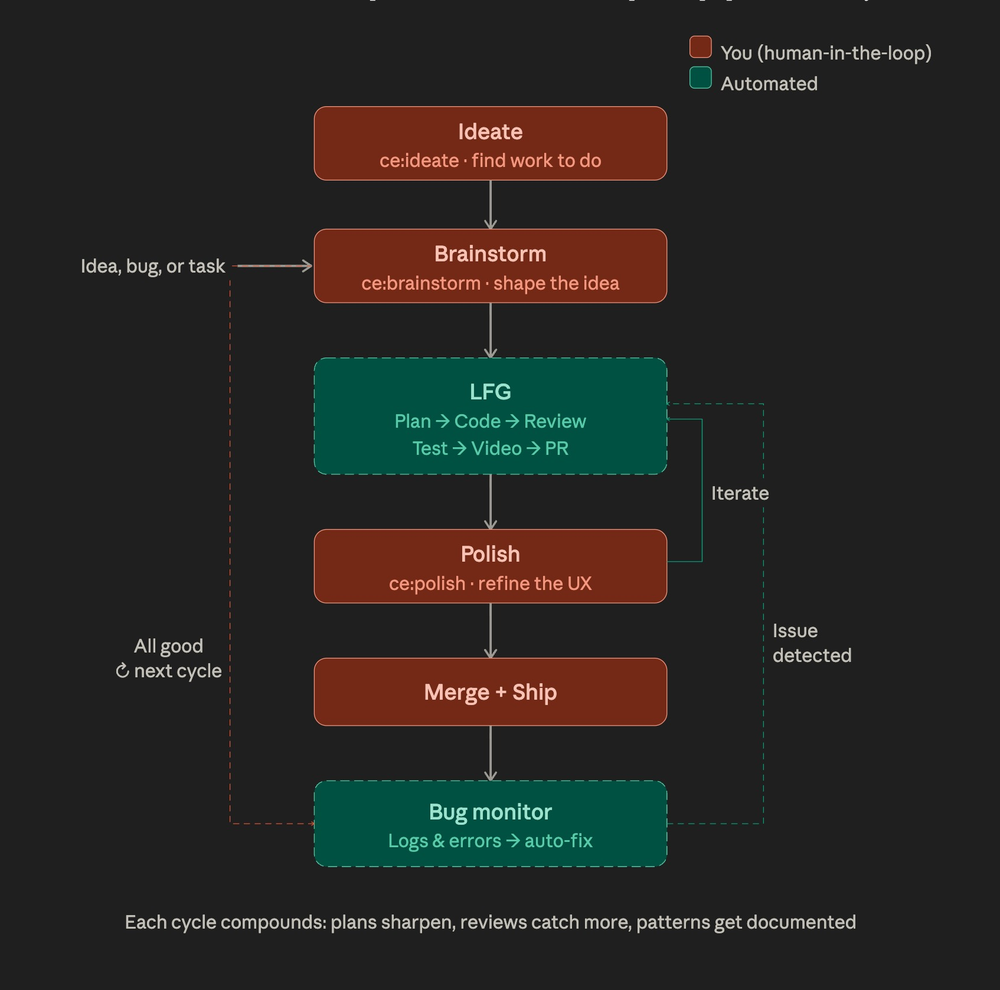

# Video Intel

> **30 seconds to read a mind map vs. 30 minutes to watch the video.**
> Scanned 15 videos from a single channel in under 2 minutes, ~$0.15-0.25 each.
> Free tier covers 8 hours of YouTube video per day.

Multimodal video intelligence powered by Gemini. Scan YouTube channels,
generate thematic mind maps, and produce enriched transcripts that capture
what was said AND what was shown on screen.

## Key Principles

- **Multimodal, not transcript-based.** Gemini sees video frames at 1 FPS,
  reads all on-screen text, and hears audio simultaneously. When a presenter
  says "as you can see here," the output tells you what was actually shown.
- **Decoupled task prompting.** Transcription (audio) and speaker identification
  (vision) run as separate tasks within a single prompt to preserve attention
  quality, borrowed from Laurent Picard's research.
- **Scan-then-triage funnel.** Mind maps are cheap and fast. Read 30-second
  summaries, then spend transcript budget only on videos worth deep engagement.
- **Idempotent processing.** Re-running a scan skips already-processed videos.
  Safe to interrupt, safe to re-run.

## How It Works

The architecture is a narrowing funnel - like fishing, where you look for
birds before you cast a line and read the water before you commit to a spot.

```text
┌─────────────────────────────────────────────────────────────────┐
│  SCAN (the birds)                          Cost: ~$0.20/video   │
│  ┌───────────────┐    ┌───────────────────┐    ┌─────────────┐  │
│  │ YouTube Data  │───>│ Gemini Multimodal │───>│ mindmap.md  │  │
│  │ API: discover │    │ API: watch frames │    │ meta.json   │  │
│  │ new videos    │    │ + audio (parallel)│    │ per video   │  │
│  └───────────────┘    └───────────────────┘    └─────────────┘  │
├─────────────────────────────────────────────────────────────────┤
│  TRIAGE (the drop-off)                     Cost: $0 (no API)    │
│  ┌──────────────────────────────────────────────────────────┐   │
│  │ You + Claude read mind maps. No Gemini needed.           │   │
│  │ "Which of these 15 videos matter for agentic patterns?"  │   │
│  └──────────────────────────────────────────────────────────┘   │
├─────────────────────────────────────────────────────────────────┤
│  TRANSCRIPT (the catch)                    Cost: ~$0.50/video   │
│  ┌────────────────────┐    ┌─────────────────────────────────┐  │
│  │ Gemini: 3-task     │───>│ transcript.md                   │  │
│  │ decoupled prompt   │    │ Diarized speech interleaved     │  │
│  │ (audio + vision +  │    │ with SCREEN sections describing │  │
│  │  speaker ID)       │    │ slides, diagrams, code, demos   │  │
│  └────────────────────┘    └─────────────────────────────────┘  │
├─────────────────────────────────────────────────────────────────┤
│  CONCEPTS (the index)                      Cost: ~$0.001/video  │
│  ┌────────────────────┐    ┌─────────────────────────────────┐  │
│  │ Gemini: text-only  │───>│ concepts.json per video         │  │
│  │ reads mindmap.md + │    │ Canonical IDs + synonyms        │  │
│  │ existing taxonomy  │    │                                 │  │
│  └────────────────────┘    │ taxonomy.json (derived master)  │  │
│                            └─────────────────────────────────┘  │
├─────────────────────────────────────────────────────────────────┤
│  SEARCH (the retrieval)                    Cost: ~$0.02/query   │
│  ┌───────────────────────────────────────────────────────────┐  │
│  │ Concept search: taxonomy.json labels + aliases (free)     │  │
│  │ Hybrid search: BM25 keyword + vector semantic + RRF fusion│  │
│  │   Voyage AI embeds (voyage-4-large docs, voyage-4-lite    │  │
│  │   queries), LanceDB stores + searches, BM25 matches exact │  │
│  │   words in titles + text. Results include full transcript │  │
│  │   passages + clickable YouTube URLs with timestamp links. │  │
│  └───────────────────────────────────────────────────────────┘  │
└─────────────────────────────────────────────────────────────────┘
```

**scan** - Fetch new videos from configured channels, generate thematic mind
maps in parallel via Gemini. Optionally auto-generate transcripts for channels
where you want everything.

**transcript** - Fused document for a single video: diarized speech interleaved
with timestamped SCREEN sections describing slides, diagrams, code, and demos.
Speaker names identified from visual cues with evidence.

**concepts** - Extract and normalize key concepts from each mindmap against a
growing canonical vocabulary. One video calls it "Agent-Centric Engineering,"
another calls it "Multi-Agent Orchestration" — the concept layer resolves
them to the same canonical ID.

**taxonomy-build** - Rebuild the master vocabulary (`taxonomy.json`) from all
per-video concept files. This is a derived artifact — always rebuildable,
never manually edited.

**triage** - After scanning, ask Claude (no Gemini cost):

> "Read the mind maps in ~/video-intel/natebjones/ from this week and tell me
> which videos are worth watching for agentic AI patterns."

## What a Fused Transcript Looks Like

Traditional transcripts lose everything visual. When a presenter says "as you
can see here," you see nothing. The fused transcript captures both channels:

```text
[01:09] Ray (Developer and Instructor): "But then this introduced
a brand new problem whereby in session one you would have a pretty
fresh, clean, and relevant memory. And then as you go on, you would
notice that Claude Code decides to add more and more stuff to its
memory and you get noise and contradictions and stuff like that."

  SCREEN [01:09-01:31] [diagram]: Excalidraw diagram titled
  'THE PROBLEM WITH AI MEMORY', illustrating how memory accumulates
  noise and contradictions over multiple sessions (Session 1 to
  Session 20).

[01:32] Ray (Developer and Instructor): "And Claude did have some
instructions in the system prompt telling it to verify that the
memory is still correct and up-to-date, but that didn't really
do a good job."
```

This is real output from scanning [Ray Amjad's](https://youtube.com/@ramjad)
channel. Speaker names are identified from visual cues (Zoom labels, name
cards, badges, slide footers) with evidence provided for each identification.

## Why This Architecture

- **Gemini watches, Claude thinks.** Best tool for each job, not competing models.
- **Mind maps first, transcripts second.** 30-second scan before 15-minute commitment.
- **Three decoupled tasks, not one prompt.** Tokens compete for attention - split audio, vision, and speaker ID for better quality.
- **One model replaces four.** Gemini Flash 3.x does what Whisper + pyannote + Claude + Gemini did separately - and captures visual content they never could.
- **Prompts are fuel, the skill is the engine.** External, self-contained, swappable. No hidden prefix assembly.
- **Per-channel config.** Daily creators get `since: 10d`. Monthly creators get `since: 120d`. Each channel captures your relationship with that creator.
- **The skill only does Gemini work.** Triage and deep-dive are conversations with Claude, not API calls. They were in the design, then deliberately cut.

## Plugin Contents — Two Skills

As of v1.5.0, this repo ships as a **plugin** containing two independent skills.
Both get installed together; Claude picks the right one based on what you ask.

| Skill | What it does | Trigger phrases |
| ----- | ------------ | --------------- |
| **video-intel** | Scan YouTube channels, generate mind maps, produce rich transcripts with on-screen content, extract concepts, hybrid search across the library | "scan my channels", "transcribe this video", "what videos cover X", "what should I watch" |
| **translate-bcs** | Translate YouTube videos and rich transcripts into Bosnian/Croatian/Serbian (BCS) subtitles. Two paths: fast captions-first via YouTube SRT for short videos, or rich-transcript-first via video-intel for long videos where the SRT path drifts. Also downloads English SRT only on request. | "translate to Bosnian/Croatian/Serbian", "BCS subtitles", "titl na bosanski", "just give me the SRT" |

The two skills stay operationally independent — `translate-bcs` does not read video-intel's
channel config, taxonomy, or meta files. The integration point is a file handoff:
for context-heavy videos, `translate-bcs` reads a rich transcript that `video-intel`
produced. Claude orchestrates both CLI steps in a single conversation.

## Quick Start

```bash
# 1. API keys (both free)
export GEMINI_API_KEY=your_key    # https://aistudio.google.com/apikey
export YOUTUBE_API_KEY=your_key   # https://console.cloud.google.com/apis/credentials

# 2. Dependencies
pip install google-genai google-api-python-client pyyaml youtube-transcript-api

# 3. Clone the repo, cd into it, and open Claude Code:
git clone https://github.com/dzivkovi/video-intel.git
cd video-intel
claude
#    On first launch, Claude Code shows a trust prompt for the video-intel
#    plugin. Click "Install for this project". Both skills become available.
#    No manual config needed — the project settings auto-register the plugin.
#
# 4. Configure channels in config.yaml, then:
python scripts/video_intel.py scan
```

Or in Claude Code, just say:

- **"scan my channels"** → video-intel skill
- **"translate this YouTube video to Bosnian"** → translate-bcs skill

For detailed installation guidance across platforms, see
[INSTALLATION.md](INSTALLATION.md). The plugin format is Claude Code-specific; on
other tools that consume the open Agent Skills format, the individual skill
folders (`skills/video-intel/` or `skills/translate-bcs/`) may be usable
independently — interoperability with non-Claude-Code tools has not been verified
by this repo.

**Upgrading from v1.4.x or earlier:** The repo went from "single skill" to "plugin
with two skills." If you previously installed by copying the repo into
`~/.claude/skills/video-intel/`, remove that directory and re-install via one of
the plugin paths above. Claude Code manages the actual on-disk plugin cache
itself (under `~/.claude/plugins/cache/...`); users do not copy files there
directly.

## Configuration

### config.yaml

```yaml
output_dir: ~/video-intel
vector_db_dir: ~/.cache/video-intel/lancedb  # optional; see note below
default_since: 10d
default_prompt: mindmap-light
model: gemini-3-flash-preview
max_parallel: 10

channels:
  - name: natebjones
    url: https://youtube.com/@natebjones
    prompt: mindmap-light
    auto_transcript: all
    since: 10d
```

| Field | Default | Description |
| ----- | ------- | ----------- |
| output_dir | ~/video-intel | Where output files are saved |
| vector_db_dir | output_dir/.lancedb | LanceDB index location. Set this to a local path if `output_dir` is on a cloud-synced mount (Google Drive File Stream, OneDrive, Dropbox) - those filesystems do not support the atomic rename LanceDB needs. The `index` command runs a pre-flight probe and aborts with an actionable diagnostic before spending Voyage tokens if the path is incompatible. See [ADR-0016](docs/adr/ADR-0016-vector-db-path-config.md). |
| default_since | 10d | Default lookback window |
| default_prompt | mindmap-light | Default prompt for mind maps |
| model | gemini-3-flash-preview | Gemini model (overridable via `--model` CLI flag) |
| max_parallel | 10 | Concurrent Gemini requests (paid tier can go 50+) |

### Channel Settings

| Field | Required | Description |
| ----- | -------- | ----------- |
| name | Yes | Folder name and identifier |
| url | Yes | YouTube channel URL |
| prompt | No | Override default prompt |
| auto_transcript | No | "all" or "none" (default: none) |
| since | No | Override default lookback window (additive in selective mode) |
| playlists | No | List of playlist names to scan (enables selective mode) |
| keywords | No | List of search terms to scan (enables selective mode) |

### Selective Mode

Channels with `playlists` or `keywords` skip the date-based scan and only process
matching videos. This is useful for prolific creators where you only care about
specific topics or curated collections.

```yaml
  - name: seankochel
    url: https://youtube.com/@iamseankochel
    playlists:
      - Agent Skills
    keywords:
      - ux design
    auto_transcript: none
    since: 30d
```

- Playlist names are resolved via YouTube API (case-insensitive contains matching)
- Keywords search the entire channel history (capped at 200 results per keyword)
- `since` is additive for selective channels: also fetches recent uploads alongside playlists/keywords
- Without `since`, only playlists and keywords are fetched
- Videos from multiple playlists/keywords are deduplicated by video ID

### Since Formats

- Relative: `7d`, `10d`, `30d`, `120d`
- Absolute: `2026-01-15`
- Command-line `--since` overrides per-channel and default settings
- For selective channels, `since` adds recent uploads alongside playlists/keywords

## Usage

```bash
# Scan all configured channels
python scripts/video_intel.py scan

# Scan one channel
python scripts/video_intel.py scan --channel natebjones

# Override lookback window
python scripts/video_intel.py scan --since 30d

# Preview what would be scanned (no API calls)
python scripts/video_intel.py scan --dry-run

# Transcribe a specific video (channel auto-detected from config)
python scripts/video_intel.py transcript \
  --url "https://www.youtube.com/watch?v=XXXXX"

# Transcribe a local MP4 file (output next to source)
python scripts/video_intel.py transcript --file ~/Videos/meeting.mp4

# Transcribe a segment of a local MP4 (required for files >1GB)
python scripts/video_intel.py transcript \
  --file ~/Videos/long-demo.mp4 --start 05:30 --end 18:45

# Members-only / gated video recovery:
# drop the MP4 under output_dir/<channel>/ and artifacts land in the canonical
# channel folder with the same meta.json shape as scan-generated ones.
python scripts/video_intel.py mindmap \
  --file "./video-intel/everyinc/Compound Engineering Camp.mkv"
python scripts/video_intel.py transcript \
  --file "./video-intel/everyinc/Compound Engineering Camp.mkv"

# ...or keep the MP4 elsewhere and pass --channel explicitly:
python scripts/video_intel.py transcript \
  --file ~/Downloads/lfML5OJc-CM.mp4 --channel everyinc

# Override Gemini model for a single command
python scripts/video_intel.py --model gemini-2.5-pro transcript \
  --url "https://www.youtube.com/watch?v=XXXXX"

# Extract concepts from all existing mindmaps
python scripts/video_intel.py concepts

# Extract concepts for one channel
python scripts/video_intel.py concepts --channel natebjones

# Rebuild master taxonomy from all concept files
python scripts/video_intel.py taxonomy-build

# Search corpus by concept (matches labels + aliases)
python scripts/video_intel.py search "skills standard"
python scripts/video_intel.py search "context window" --channel natebjones --limit 5

# Hybrid search — BM25 keyword + vector semantic + RRF fusion
# (requires VOYAGE_API_KEY — free at https://dash.voyageai.com/)
pip install lancedb voyageai
python scripts/video_intel.py index                          # build index (one-time)
python scripts/video_intel.py search "helium supply chain" --vector
python scripts/video_intel.py search "code beats markdown" --vector --preview

# Cross-creator nugget brief — consultant-grade synthesis across multiple creators
# Retrieves top-K hybrid-search excerpts, then feeds them through a cross-creator
# prompt that produces: consensus, divergence (with underlying frame-of-reference
# differences), attributed nuggets (mental models, metaphors, warnings,
# workarounds, business psychology), and "1+1=3" emergent insights that arise
# from comparing creators' positions. Every claim cites [creator @ HH:MM].
python scripts/video_intel.py nugget "LightRAG vs OpenBrain architectural tension"
python scripts/video_intel.py nugget "context engineering" --since 90d
python scripts/video_intel.py nugget "graph RAG" --channel engineerprompt
python scripts/video_intel.py nugget "second brain patterns" --output brief.md
```

See [`examples/nugget-lightrag-vs-openbrain-architectural-tension.md`](examples/nugget-lightrag-vs-openbrain-architectural-tension.md) for a sample output.

## Prompt Customization

Prompts live in `prompts/`. Each file is self-contained.

| File | Purpose |
| ---- | ------- |
| mindmap-knowledge.md | Thematic mind map with domain terminology + timestamps (default) |
| mindmap-light.md | Fast thematic scan (4-6 branches, tight bullets) |
| mindmap-heavy.md | Comprehensive extraction (6-10 branches, resources, perspectives) |
| transcript.md | Three-task diarized transcript with screen content |
| concepts.md | Concept extraction + normalization against taxonomy |
| nugget-brief.md | Cross-creator consultant-grade synthesis (consensus / divergence / attributed nuggets / 1+1=3 emergent insights) |
| translate-bcs.md | BCS subtitle translation, video-understanding fallback path (`translate_video.py`) |
| translate-bcs-from-srt.md | BCS subtitle translation, captions-first path (`translate_video.py`) |
| translate-bcs-from-transcript.md | BCS subtitle translation from a rich transcript (`translate_video.py --from-transcript`) |

Add a `.md` file to `prompts/` and reference it in config.yaml by filename
(without extension).

## Output

```text
~/video-intel/
├── taxonomy.json                                    # Master vocabulary (derived)
├── natebjones/
│   ├── 2026-03-20-building-mcp-agents.mindmap.md
│   ├── 2026-03-20-building-mcp-agents.transcript.md
│   ├── 2026-03-20-building-mcp-agents.concepts.json
│   ├── 2026-03-20-building-mcp-agents.meta.json
│   └── ...
```

- **mindmap.md** - Thematic mind map with timestamps. Obsidian-compatible.
- **transcript.md** - Fused diarized transcript with SCREEN sections.
- **concepts.json** - Normalized concepts with canonical IDs, aliases, confidence.
- **meta.json** - Video metadata, source URL, processing history.
- **taxonomy.json** - Master vocabulary derived from all concept files. Rebuildable.

## Working with Concepts

The concept layer solves the vocabulary control problem: different videos use
different words for the same idea. The pipeline produces a **thesaurus** —
canonical terms with synonyms — not a full knowledge graph.

### The workflow

```text
mindmap.md ──> Gemini (text-only) ──> concepts.json ──> taxonomy-build ──> taxonomy.json
  (per video)    reads mindmap +         (per video)       aggregates all      (master)
                 existing taxonomy       source of truth    concept files       derived
```

Each video's `concepts.json` is the source of truth. `taxonomy.json` is always
derived — delete it and rebuild from scratch with `taxonomy-build`.

### What you can do with taxonomy.json today

```bash
# Top concepts across your corpus
jq '.concepts | to_entries | sort_by(-.value.video_count) | .[0:15] |
  .[] | "\(.value.video_count)x  \(.value.preferred_label)"' \
  video-intel/taxonomy.json

# Which videos cover a specific concept?
grep -rl "multi_agent_orchestration" video-intel/*/  --include="*.concepts.json"

# What does natebjones cover that ramjad doesn't?
diff <(jq -r '.concepts[].concept_id' video-intel/natebjones/*.concepts.json | sort -u) \
     <(jq -r '.concepts[].concept_id' video-intel/ramjad/*.concepts.json | sort -u)

# Find all aliases for a concept
jq '.concepts["ai-engineering.context_window_optimization"]' video-intel/taxonomy.json

# Review uncertain normalizations
grep -rl '"uncertain"' video-intel/*/ --include="*.concepts.json"
```

### Concepts + hybrid search

Concept IDs are attached to each transcript chunk in the vector index, enabling
two complementary search modes:

- **Concept search** (`search "query"`) — matches taxonomy labels/aliases.
  Returns video-level groupings. Use for "which videos cover X?"
- **Hybrid search** (`search "query" --vector`) — BM25 keyword + vector
  semantic + RRF fusion. Returns ranked transcript passages with full text,
  YouTube URLs with timestamp deep-links. Use for "what did someone say about X?"

See [ADR-0012](docs/adr/ADR-0012-vector-search-lancedb-voyage.md) for
embedding choices and [ADR-0013](docs/adr/ADR-0013-hybrid-search-rrf-fusion.md)
for the hybrid search decision. Evaluation queries in `evals/`.

## Cost

Using Gemini 3 Flash ($0.50/M input tokens, $1.00/M audio, $3.00/M output):

| Operation | Typical Cost |
| --------- | ----------- |
| Mind map for a 15-min video | ~$0.15-0.25 |
| Mind map for a 45-min video | ~$0.40-0.60 |
| Full transcript for a 30-min video | ~$0.30-0.50 |
| Weekly scan of 5 channels (30 videos) | ~$5-10 |
| Batch API (async, 50% discount) | Half the above |

**Free tier** covers 8 hours of input video per day. When active, input tokens
cost nothing and output tokens ($3/M) become nearly the entire bill — about
$0.05 per video. Steady-state weekly scans of 30 videos fit comfortably within
the daily free quota.

**First-run backfill:** If you configure channels with long lookback windows
(e.g., `since: 90d`), the first scan processes every video in that window.
Start with `--dry-run` to preview volume, or use short `since` values and
widen them gradually.

**Rate limits:** Free tier has lower requests-per-minute limits. The script
retries automatically with backoff on 429 errors, but if you hit throttling,
reduce `max_parallel` in config.yaml (try 3-5). Paid tier users have
generous limits (20,000+ RPM) and can increase parallelism freely. Check
your limits at [Google AI Studio](https://aistudio.google.com/apikey) or
the [rate limits docs](https://ai.google.dev/gemini-api/docs/rate-limits).

## Regeneration Workflow

Over time you will improve prompts, switch models, or want to rebuild artifacts.
All commands support `--force` to regenerate even when output files already exist.
Use `--model` / `-m` to switch models without editing config.yaml:

### Regenerate mindmaps (e.g., after changing prompt)

```bash
# Preview what would be regenerated
python scripts/video_intel.py scan --channel natebjones --dry-run

# Regenerate all mindmaps for a channel with the current prompt
python scripts/video_intel.py scan --channel natebjones --force

# Regenerate a single video's mindmap with a specific prompt
python scripts/video_intel.py mindmap \
  --url "https://www.youtube.com/watch?v=XXXXX" \
  --prompt mindmap-knowledge --force

# Retry failed transcripts with a different model
python scripts/video_intel.py --model gemini-2.5-pro transcript \
  --url "https://www.youtube.com/watch?v=XXXXX" --force
```

### Regenerate concepts (e.g., after tuning concepts prompt)

```bash
# Re-extract concepts for one channel
python scripts/video_intel.py concepts --channel natebjones --force

# Rebuild taxonomy from all concept files
python scripts/video_intel.py taxonomy-build
```

### Regenerate transcripts

```bash
python scripts/video_intel.py transcript \
  --url "https://www.youtube.com/watch?v=XXXXX" --force
```

### Full regeneration sequence

When changing the mindmap prompt, the downstream artifacts (concepts, taxonomy)
should also be regenerated. The recommended order:

```bash
# 1. Regenerate mindmaps with new prompt
python scripts/video_intel.py scan --force

# 2. Re-extract concepts from the new mindmaps
python scripts/video_intel.py concepts --force

# 3. Rebuild the master taxonomy
python scripts/video_intel.py taxonomy-build
```

Transcripts are independent of mindmaps and concepts - they only need
regeneration if you change the transcript prompt.

## Transcript Resilience

Gemini sometimes returns malformed JSON for transcript requests (truncated
strings, missing brackets, stray prose around the JSON payload). The transcript
command handles this gracefully:

1. **Direct parse** - try the raw response as-is.
2. **Isolation** - strip markdown fences and surrounding prose, find the JSON.
3. **Salvage** - if full parse fails, recover individual sections (speech
   entries, screen content, speakers) from the partial response.
4. **Bounded retry** - if salvage produces too little content, retry once.

Partial transcripts are written with a visible warning and `transcript_status:
"partial"` in meta.json. They are useful for casual browsing and search but may
be incomplete. For strategically important videos, rerun with a different model
or retry later:

```bash
python scripts/video_intel.py --model gemini-2.5-pro transcript \
  --url "https://www.youtube.com/watch?v=XXXXX" --force
```

On parse failure, the raw Gemini response is saved as a `.transcript.raw.txt`
sidecar file for debugging.

## Bosnian/Croatian/Serbian (BCS) Translation Utility

A separate utility script for translating YouTube video audio into
BCS subtitles. Not part of the video-intel
pipeline, but shares the same Gemini API patterns and lives in this repo.

**About BCS.** Bosnian, Croatian, and Serbian — collectively "BCS" — are
mutually-intelligible South Slavic languages spoken across the former
Yugoslavia (Bosnia, Serbia, Croatia, Montenegro, plus Serbian-speaking
communities in Kosovo) and the diaspora. Same grammar, same core
vocabulary; differences are dialect, script, and a few hundred preferred
words. This script outputs Bosnian-neutral Latin-script ijekavica —
natural across all four countries and readable by Serbian Cyrillic users
without conversion.

**Why this matters.** Many immigrants around the world don't speak English
at all. Most long-form journalism, podcasts, and political interviews
that shape global discourse are in English — especially in North America.
For BCS speakers in diaspora communities, that means missing out.
This script gives them a path to read those videos in their own language —
about $0.50 for short videos via the captions-first path, or ~$0.90 per
2-hour video via the rich-transcript path. Built for family, elders, and
friends who live in North America but cannot benefit from English-language
YouTube.

```bash
# Translate a video to BCS (auto-detects title, saves to file)
# Default behavior: tries YouTube English captions first, falls back to video
python scripts/translate_video.py "https://www.youtube.com/watch?v=VIDEO_ID"

# Save to a specific directory (e.g., the examples folder in this repo)
python scripts/translate_video.py "https://www.youtube.com/watch?v=Sm7568B0BC8" \
  --output-dir ./examples

# Print to stdout instead of file
python scripts/translate_video.py "https://www.youtube.com/watch?v=VIDEO_ID" --stdout

# Use a different model (default: gemini-2.5-pro)
python scripts/translate_video.py "https://www.youtube.com/watch?v=VIDEO_ID" \
  --model gemini-2.5-flash

# Force the video-understanding path even when captions are available
# (useful for testing the fallback or when caption quality is known to be bad)
python scripts/translate_video.py "https://www.youtube.com/watch?v=VIDEO_ID" \
  --force-video
```

Output follows the same `{date}-{slug}` naming convention as video-intel
artifacts. See [examples/2026-04-05-the-tide-has-turned-rejoice-in-this.translate-bcs.txt](examples/2026-04-05-the-tide-has-turned-rejoice-in-this.translate-bcs.txt)
for a real translation output.

**Translation strategy: SRT-first.** The script first checks YouTube for an
English caption track via `youtube-transcript-api`, preferring manually
authored captions over auto-generated. When a caption track exists, the
text goes to Gemini as a single non-streaming request — completes in
seconds, costs ~10-20K input tokens, and avoids the long-video safety-filter
soft-stops we documented in
[ADR-0015](docs/adr/ADR-0015-permissive-safety-filters-for-faithful-reporting.md).
The output file's `**Source mode:**` field tells you exactly where the
BCS came from: manual captions, auto-generated captions (with silent ASR
cleanup), or direct video audio. When the captions track is auto-generated,
the SRT prompt instructs Gemini to repair punctuation and capitalization
as part of the translation pass.

**Long videos: rich-transcript path.** For videos over ~90 minutes, or
content where on-screen text and speaker changes carry meaning (lectures
with slides, multi-speaker interviews, news-style overlays, OCR-heavy
material), YouTube's SRT alone loses too much. Run two commands instead
of one:

```bash
# Step 1 — produce a rich transcript via video-intel
python scripts/video_intel.py transcript --url URL --channel <name>

# Step 2 — translate the transcript to BCS
python scripts/translate_video.py --from-transcript <path>
```

This path keeps speaker labels and on-screen content in the BCS output.
Cost is roughly $0.50 (transcript) + $0.40 (translation) = ~$0.90 per
2-hour video. The translate-bcs skill auto-routes long videos here. For
the engineering rationale, see
[docs/solutions/integration-issues/gemini-flash3-vs-pro25-chunked-transcription-20260427.md](docs/solutions/integration-issues/gemini-flash3-vs-pro25-chunked-transcription-20260427.md).

**Video fallback (used when no captions exist):** Gemini's input limit is
1M tokens. Translation reads audio only — the `translate-bcs` prompt never
references on-screen text — so the script **defaults to low media resolution**
(~100 tokens/sec, fits videos up to ~170 min in a single request). Audio
quality is unaffected: `media_resolution` only controls video frame tokens,
and audio is tokenized at a fixed 32 tokens/sec regardless. Pass
`--high-res` (~300 tokens/sec, ~55 min per request) only when the prompt
needs to read on-screen text such as slides or burned-in captions.

**Long videos (resolution-aware threshold):** The chunking cutoff depends on
which media resolution you're using. At the default low resolution, videos
up to **150 minutes** run as a single request. With `--high-res`, the
threshold drops to **50 minutes**. Above the threshold, the script
auto-chunks into uniform `--chunk-minutes` (default 20) segments from the
start, and each chunk produces a separate part file — these are the
primary artifacts. Both single-request and chunked paths carry coverage
diagnostics in the output header: single-request gets a TRUNCATED
annotation if Gemini stops early, and stitched files include a
per-segment coverage table plus `<!-- segment ... -->` dividers around
non-ok chunks.

Long-video workflow is two steps: **translate** (produces part files), then
**stitch** (merges them). Part files use filenames for stable slug-based naming;
the video title is translated to BCS during stitch via a single lightweight
Gemini call. Timestamps within chunks are relative to the clip start — the
stitcher applies absolute offsets from the filename and normalizes to `[HH:MM:SS]`.

```bash
# Any talking-head video up to ~2.5 hours — single pass, low-res default
python scripts/translate_video.py "https://www.youtube.com/watch?v=VIDEO_ID"

# Partial translation — e.g. first hour only, skip the interview segment
python scripts/translate_video.py "https://www.youtube.com/watch?v=VIDEO_ID" \
  --end 63

# Stitch auto-chunked parts (for videos past the resolution-aware threshold)
python scripts/translate_video.py "https://www.youtube.com/watch?v=VIDEO_ID" --stitch

# Backfill a failed chunk
python scripts/translate_video.py "https://www.youtube.com/watch?v=VIDEO_ID" \
  --start 40 --end 60

# Slide-driven talk where on-screen terminology matters (rare)
python scripts/translate_video.py "https://www.youtube.com/watch?v=VIDEO_ID" --high-res

# Override the auto-translated title
python scripts/translate_video.py "https://www.youtube.com/watch?v=VIDEO_ID" \
  --stitch --title "Moj Naslov"
```

**Partial translations:** When stitching a subset of a video (e.g., only
the first hour of a 2h18m video), the output includes a `**Coverage:**`
line in the header and a BCS reader note indicating what portion was
translated. Full translations omit these — no clutter in the normal case.

### Translating from a rich transcript (`--from-transcript`)

Some videos carry meaning that YouTube's English captions cannot preserve:
a journalist cutting between their own commentary and clips of other
speakers, on-screen overlays labeling who is speaking, quoted text from
documents or news tickers, footage with burned-in captions from another
news outlet. The captions-first path sees none of that. The
video-understanding fallback reads audio only. Both paths will translate
what is said but lose *why it was shown*.

The fix is to generate our own rich transcript first (speech + on-screen
content + speaker identification), then translate that file. Two
commands, run manually in sequence:

```bash
# Step 1 — rich transcript. One Gemini call, reads the video with vision
# enabled, produces speakers, SCREEN sections, and On-screen text: lines
# in English. Typical 10-minute video: 60-90 seconds, a few cents.
python scripts/video_intel.py --log-level info transcript \
  --url "https://www.youtube.com/watch?v=VIDEO_ID"
# Output: ~/video-intel/{channel-or-_standalone}/{date}-{slug}.transcript.md

# Step 2 — translate the transcript into BCS. Text-in / text-out. Preserves
# timestamps, SCREEN markers, On-screen text labels, speaker names; translates
# speech content, speaker role parentheticals, SCREEN descriptions, OCR text,
# and the Speaker Identification Evidence footer.
python scripts/translate_video.py --log-level info \
  --from-transcript "path/to/{date}-{slug}.transcript.md"
# Output: sibling file — same directory as the transcript, same base name,
# `.translate-bcs.txt` extension.
```

**When to use this instead of the default path:**

| Symptom | Use |
| ------- | --- |
| Plain talking head, long interview, single speaker, no overlays matter | **Default** (`translate_video.py URL`) — captions-first, fastest |
| No English captions available but audio is enough | **Default** falls through to video understanding automatically |
| Journalist cutting to clips of other speakers; overlays label who is speaking; OCR text matters; news tickers; multi-source edits | **`--from-transcript`** (run the two-step pipeline above) |

**Real example.** Abby Martin / Double Down News, 10 minutes, heavy
editorial cutting with labeled clips:

```bash
python scripts/video_intel.py --log-level info transcript \
  --url "https://www.youtube.com/watch?v=hLQbPCvV8W8"
# → video-intel/double-down-news/2026-04-07-abby-martin-went-to-israel-its-worse-than-you-think.transcript.md
# (67s, 288 lines with SCREEN / On-screen text / speaker labels)

python scripts/translate_video.py --log-level info \
  --from-transcript "video-intel/double-down-news/2026-04-07-abby-martin-went-to-israel-its-worse-than-you-think.transcript.md"
# → video-intel/double-down-news/2026-04-07-abby-martin-went-to-israel-its-worse-than-you-think.translate-bcs.txt
# (1m 54s, 289 lines, 12K tokens, thinking_budget=128 auto-applied,
#  timestamps / SCREEN / On-screen text counts preserved 1:1)
```

See [video-intel/double-down-news/...translate-bcs.txt](video-intel/double-down-news/2026-04-07-abby-martin-went-to-israel-its-worse-than-you-think.translate-bcs.txt)
for the full output.

**Design notes.** This is a *manual* two-step handoff, not an auto-chained
pipeline — the intermediate transcript is a reviewable artifact, and the
two scripts stay operationally independent per [CLAUDE.md](CLAUDE.md).
The `--from-transcript` flag accepts any transcript-shaped markdown file;
validation is permissive (file must exist, be under 500KB, and contain at
least one `[MM:SS]` timestamp line — no required footer, no strict header
format). The path inherits `SRT_DEFAULT_THINKING_BUDGET=128` on 2.5 Pro,
the same hallucination mitigation used on the captions path. `--stdout`
and `--force` work the same way as elsewhere.

**Error handling:** The script retries automatically on Gemini server
errors (408, 500, 502, 503, 504) with exponential backoff — up to 8
retries over ~30 minutes. Rate limits (429) retry 3 times with shorter
waits. A 20-minute read timeout prevents infinite hangs when Gemini
accepts a request but never responds — the connection is aborted and
your terminal is returned. All retries log progress with
`(Ctrl+C to abort)`.

**Note:** The Gemini Python SDK has a
[known bug](https://github.com/googleapis/python-genai/issues/1893) where
requests can stall at the socket level. If this happens, try `--ipv4` to
force IPv4 connections as a workaround.

## Cross-Platform Compatibility

This repo ships as a Claude Code **plugin**: a `.claude-plugin/plugin.json`
manifest plus a `skills/` directory holding two independent skills, with
`scripts/` and `prompts/` shared at the plugin root. The `plugin.json` format
and the plugin auto-discovery flow are Claude Code-specific.

The two `SKILL.md` files themselves follow the open Agent Skills format
(agentskills.io). Other tools that consume that spec — Gemini CLI, Cursor,
Copilot, and others — *may* be able to use `skills/video-intel/` or
`skills/translate-bcs/` as standalone skill folders, but this interoperability
has not been verified by this repo. If you try a non-Claude-Code setup, results
welcome as feedback. API keys are read from environment variables in all cases.

## Packaging

To package for distribution, tell Claude Code: "Package my video-intel skill."

## Design Influences & Sources

[Gemini API Development Skill](https://github.com/google-gemini/gemini-skills/blob/main/skills/gemini-api-dev/SKILL.md)
is a knowledge skill - it gives coding agents correct model names and
SDK patterns so they write working Gemini code. It doesn't watch videos. The
video-watching capability is built into Gemini itself. Video-intel is the
execution skill that wraps that capability: you say "scan my channels" and
it calls the API, produces mind maps, saves files. Google published the
cookbook. This is the kitchen.

| What shaped it | Source | Key takeaway |
| -------------- | ------ | ------------ |
| Decoupled task prompting | Laurent Picard ([TDS](https://towardsdatascience.com/unlocking-multimodal-video-transcription-with-gemini/), [GCC](https://medium.com/@PicardParis/unlocking-multimodal-video-transcription-with-gemini-part4-3381b61aaaec)) | Split transcription from speaker ID to preserve attention quality |
| Speaker evidence | Philipp Schmid ([gemini-samples](https://github.com/philschmid/gemini-samples/blob/main/examples/gemini-analyze-transcribe-youtube.ipynb)) | Pre-seed names, require visual evidence for each ID |
| Diarization strategy | Google Cloud ([partner blog](https://cloud.google.com/blog/topics/partners/how-partners-unlock-scalable-audio-transcription-with-gemini/)) | Zero-shot for transcription, few-shot for diarization |
| API patterns | Google ([video](https://ai.google.dev/gemini-api/docs/video-understanding) & [audio](https://ai.google.dev/gemini-api/docs/audio) docs) | Token economics, context caching, multimodal config |
| Gemini vs Whisper | [Voice Writer](https://voicewriter.io/blog/best-speech-recognition-api-2025), [Brown CCV](https://docs.ccv.brown.edu/ai-tools/services/transcribe/comparing-speech-to-text-models) | Single-model Gemini beats multi-model Whisper + pyannote pipeline |
| Skills ecosystem | Mark Kashef, [Early AI-dopters](https://www.skool.com/earlyaidopters) community | Pointed to Google's [gemini-skills](https://github.com/google-gemini/gemini-skills) repo; built on the open cross-platform [Agent Skills format](https://code.claude.com/docs/en/skills) |

### How this project is built: Compound Engineering



Every feature here goes through the [Compound Engineering](https://every.to/guides/compound-engineering)
loop from Every.to: a brainstorm shapes the idea, a plan turns it into a
blueprint, work implements it on a branch, review catches issues, and the
learnings get compounded so the next feature is easier. The four artifacts each
answer a different question and do not duplicate each other: brainstorm answers
"what and why" (in `docs/brainstorms/`), plan answers "exactly how" (in
`docs/plans/`), the GitHub issue is a backlog pointer to the plan, and the PR
closes both with code. See the
[internal learning doc](docs/solutions/workflow-issues/compound-engineering-four-artifacts-20260417.md)
for why issue bodies in this repo link to plan files rather than copy them.

The diagram above is from Every's methodology guide and evolves with the
plugin; some boxes shown (for example the initial ideate box and the post-ship
polish box) are newer additions I have not adopted yet, so treat the picture as
the direction of travel rather than the current workflow.

Architected through iterative conversation with [Claude Desktop](https://claude.ai/) -
from use case discovery through research synthesis to working prototype.
Engineered and shipped in [Claude Code](https://claude.ai/code).

## License

MIT
